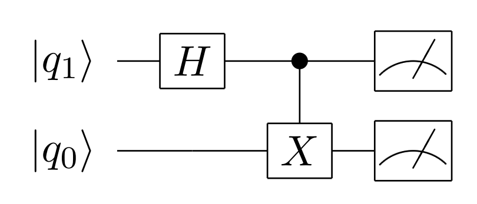
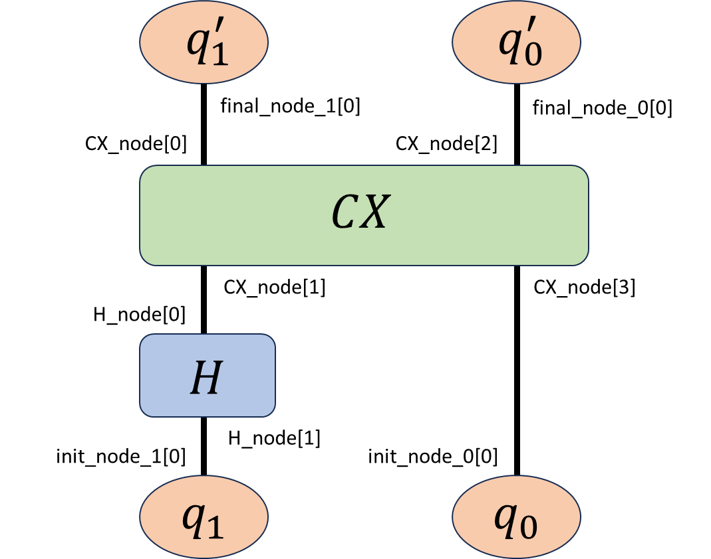

# tensor_network_for_quantum_computing
量子回路による量子もつれ状態の生成と観測をテンソルネットワークを使って計算するコードです。詳細は以下の内容をご確認ください。
https://zenn.dev/torataro/articles/2023-11-12-tensor_network

## 量子回路
量子もつれ状態を生成する回路は以下のとおりです。<br/>
<br/>

## テンソルネットワーク
上記量子回路のテンソルネットワーク表現は次のとおりです。コードではこれをシミュレーションします。<br/>
<br/>

## 実行方法例
コマンドライン引数`quantum_state`には観測したい量子状態00,01,10,11のいずれかを指定してください。
```
python quantum_entanglement.py --quantum_state 00
```